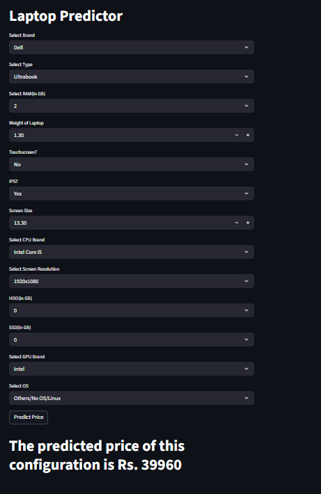

# 💻 Laptop Price Predictor

An end-to-end machine learning project that predicts laptop prices based on hardware specifications such as brand, RAM, storage, CPU, GPU, display features, and operating system.  
The model is built using **scikit-learn pipelines** and deployed through an interactive **Streamlit web application**.
---

## 🔗 Live Demo (Streamlit App)

You can interact with the Laptop Price Predictor through the Streamlit web application:

👉 **Live Demo:** https://laptop-price-predictor.streamlit.app

> If the app is not currently live, you can run it locally by following the instructions in the **How to Run Locally** section.
---
## 📌 Project Overview

Laptop prices vary significantly depending on their specifications, making it difficult for users to estimate a fair price.  
This project aims to predict a **reasonable laptop price** using machine learning regression techniques based on key hardware features.

The project demonstrates a complete ML workflow:
- Data preprocessing
- Feature engineering
- Model training
- Model serialization
- Deployment using Streamlit

---

## ⚠️ Disclaimer

The dataset used to train this model is based on **historical laptop pricing data**.  
As a result, the predicted prices may **not reflect current market prices**, especially for newer laptop models or recent hardware generations.

This project is intended for **educational and learning purposes only**, and the predictions should be considered **approximate estimates**, not official valuations.

---
## 🖼️ Application Preview (Streamlit UI)

Below is a preview of the Laptop Price Predictor web application built using **Streamlit**.  
The interface allows users to input laptop specifications and instantly receive a predicted price.


---
## 🧠 Tech Stack

- Python  
- Pandas, NumPy  
- Scikit-learn  
- Streamlit  
- Pickle  
- Git & GitHub  

---

## 📂 Project Structure
```
Laptop-Price-Predictor/
│
├── app.py # Streamlit application
├── pipe.pkl # Trained ML pipeline
├── requirements.txt # Project dependencies
├── README.md # Project documentation
├── Laptop price predictor.ipynb # Model training notebook
├── laptop_data.csv # Dataset
└── .gitignore # Ignored files (venv, cache, etc.)
```

---

## ⚙️ How It Works

1. The user selects laptop specifications in the Streamlit UI  
2. Inputs are passed to a trained **scikit-learn pipeline**  
3. The pipeline:
   - Encodes categorical variables
   - Scales numerical features
   - Applies the regression model  
4. The model outputs a **predicted laptop price**

---

## 🚀 How to Run Locally

### 1️⃣ Clone the repository
```bash
git clone https://github.com/Prince2409shah/Laptop-Price-Predictor.git
```
### 2️⃣ Create and activate a virtual environment
```bash
python -m venv venv
venv\Scripts\activate
```
### 3️⃣ Install dependencies
```bash
pip install -r requirements.txt
```
### 4️⃣ Run the Streamlit app
```bash
streamlit run app.py
```
## 📊 Model Details

- Trained using **scikit-learn (v1.8.0)**
- Uses a **Pipeline** for preprocessing and prediction
- Handles both **categorical** and **numerical** features
- Model serialized using **pickle**
- Predictions are based on **historical laptop pricing data**

> **Note:** Predicted prices depend on the dataset used and may reflect prices from earlier market periods.

---

## 🧪 Sample Input

- **Brand:** Dell  
- **Type:** Ultrabook  
- **RAM:** 8 GB  
- **SSD:** 256 GB  
- **CPU:** Intel Core i5  
- **Screen Size:** 13.3 inches  
- **Resolution:** 1920×1080  
- **GPU:** Intel  
- **OS:** Windows  

---

## 📈 Future Improvements

- Add laptop launch year / generation
- Support Apple Silicon processors
- Improve feature engineering
- Deploy on Streamlit Cloud
- Display model evaluation metrics in the UI
---

## 👤 Author

**Prince Shah**  
GitHub: https://github.com/Prince2409shah/Laptop-Price-Predictor